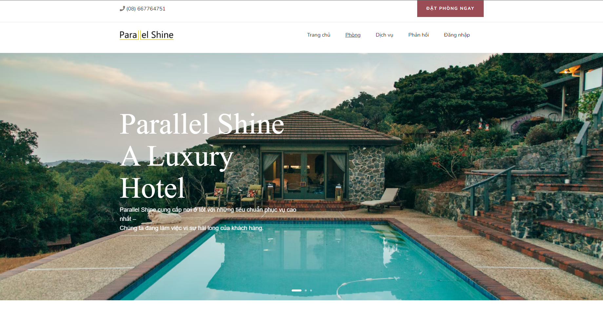

# Parallel Shine Hotel

It works with the URL: [Parallel Shine Hotel](https://demo-hotel-live.herokuapp.com/?fbclid=IwAR0MEI4_9huVQH1n4WCogfhiokQHV4OgaP14CPMVE3lJRiD0uKh2c-EGbPQ)

But sometime, it does not work because of the bandwith of heroku's server

* Install environment for executing project/building another project:
1. Initalizing project: "npm init"
2. Installing expressjs: "npm i experess"
3. Installing nodemon to follow project more clearly: "npm i nodemon"
4. Installing express-handlebars: "npm i express-handlebars"
5. Configurating command to run: package.json -> script -> create "start": "nodemon --inspect index.js" (npm start)

* How to clone:
1. Code -> Open with Github desktop (Recommend use Github desktop for easy to clone a project)
2. After clone successfull -> Open terminal in Visual Studio Code 
3. Enter "npm install" to install "node_modules" folder & "package.json-lock" file
4. Then enter "npm start" to run local machine
_Recommend to use Microsoft Edge to open_

* Illustration image:

